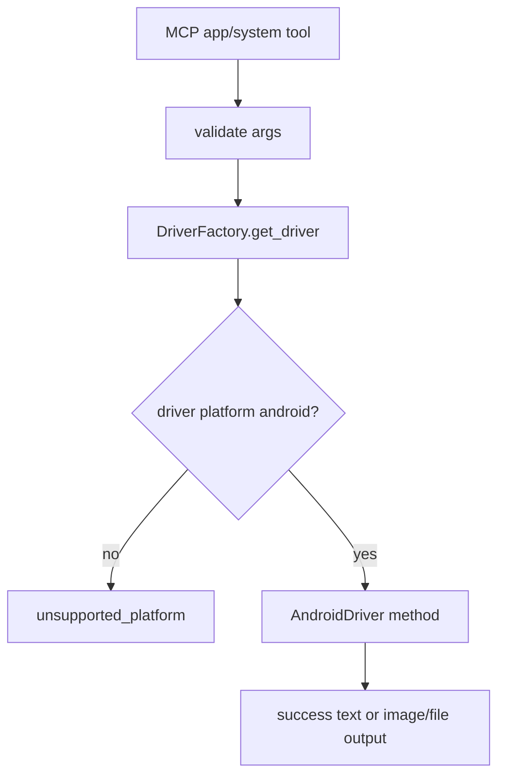

# android-app-system-tools Design

## 0. 术语约定

| 术语 | 定义 | 防冲突结论 |
|---|---|---|
| app lifecycle tools | `mobile_list_apps` / launch / terminate / install / uninstall | Android 平台先实现，iOS 后续 parity |
| system tools | button、open_url、orientation、save_screenshot 等非 recording/crash 工具 | recording/crash 单独条目 |
| packageName / bundle_id | mobile-mcp schema 中 Android/iOS 混用的应用标识字段 | 对外字段名严格跟 `server.ts`，内部可映射为 package name |

## 1. 决策与约束

### 需求摘要

在 Android live UI slice 通过后，本 feature 补齐 Android 非 recording 的 app/system 工具：`mobile_list_apps`、`mobile_launch_app`、`mobile_terminate_app`、`mobile_install_app`、`mobile_uninstall_app`、`mobile_press_button`、`mobile_open_url`、`mobile_set_orientation`、`mobile_get_orientation`、`mobile_save_screenshot`。成功标准是这些工具在 Android 设备上可用，或在系统能力限制下返回稳定结构化错误。

### 明确不做

- 不实现 recording/crash。
- 不实现 iOS app/system。
- 不改变已确认的 tool schema 字段名，例如 `packageName`、`bundle_id`、`saveTo`。
- 不允许 `mobile_open_url` 默认打开非 http(s) scheme；自定义 scheme 仍需显式开关。

### 复杂度档位

走“设备系统命令 + 文件输出安全”档位；偏离点是 host path 写入需要路径和扩展名安全约束。

### 关键决策

- Android app/system 能力优先复用 AndroidDriver，工具层不写 ADB/u2 细节。
- `mobile_save_screenshot` 复用 screenshot bytes，但额外做 host output path 和扩展名校验。
- button enum 对齐 mobile-mcp：HOME/BACK/VOLUME_UP/VOLUME_DOWN/ENTER/DPAD_*；平台不支持时返回 structured error。

### 基线风险 / 必跑命令

- 必跑 `python -m pytest`。
- Android live smoke 覆盖至少 list_apps、open_url(http)、press_button(BACK/HOME 安全选择)、orientation get/set、save_screenshot 到安全路径。
- install/uninstall 需要样本 APK；没有样本时 QA 标 blocked 或只验证 invalid path 错误，不把 skip 当完整通过。

### Top 3 风险

1. app install/uninstall 破坏用户设备状态 → live smoke 默认不执行破坏性安装/卸载，除非有测试 APK 和用户确认。
2. orientation/button 在不同设备/launcher 状态表现不一 → 只要求命令成功和可观察状态，失败给出 driver_error。
3. save_screenshot 任意路径写入风险 → path 限制在 cwd/temp，扩展名限制 `.png/.jpg/.jpeg`。

### 交付物与清洁度

- 交付物：AndroidDriver app/system 方法、对应 handlers、path/url validation、Android app/system live smoke 说明。
- 清洁度：不硬编码 package name；不提交临时截图；不绕过 path 校验。

## 2. 名词与编排

### 2.1 名词层

**现状**：AndroidDriver 已提供 UI slice 方法；app/system handlers 仍为 not_implemented 或未接通。

**变化**：

- AndroidDriver 补 `list_apps/launch_app/terminate_app/install_app/uninstall_app`。
- AndroidDriver 补 `press_button/open_url/get_orientation/set_orientation`。
- Tool layer 补 `validate_output_path(saveTo)`、`validate_file_extension`、`validate_url`。
- `AppInfo(package_name, app_name, version?)` 映射到 mobile-mcp 输出文本。

**Interface 设计检查**：

- Module：Tool layer 负责输入安全，AndroidDriver 负责平台动作。
- Seam：host path/url validation 是 tool-level seam；driver 不接受未校验 host path。
- Depth/locality：Android command 差异集中在 AndroidDriver。
- Adapter：继续使用 AndroidDriver，无新增 adapter。

### 2.2 编排层

**现状**：UI tools 已能获得 AndroidDriver。

**变化**：app/system tools 接入同一 factory；保存截图类工具先做 host path 校验再写文件。

**流程级约束**：破坏性工具标 destructive；URL 默认只允许 http(s)；output path 必须安全；driver error 保留可诊断 message。

### 2.3 挂载点清单

- Android app/system tool handlers：从 stub 切换到真实 driver。
- AndroidDriver：新增 app/system 方法。
- Path/url validation utilities：新增或补齐安全校验入口。
- Android app/system live smoke 文档/测试入口。

### 2.4 推进策略

1. 安全校验：补 path/url/package/button/orientation 校验。退出信号：无设备单测覆盖 invalid args。
2. app lifecycle：实现 list/launch/terminate/install/uninstall。退出信号：list_apps live smoke 通过，破坏性工具有安全验证策略。
3. system actions：实现 press_button/open_url/orientation。退出信号：safe live smoke 无 driver_error。
4. save_screenshot：实现扩展名/path 校验和文件写入。退出信号：安全路径生成图片且非安全路径失败。
5. 文档/证据：补复跑步骤。退出信号：QA/acceptance 可引用命令和输出。

### 2.5 结构健康度与微重构

##### 评估

- 文件级 — `drivers/android.py` 可能继续增长，但仍集中在 Android 平台 adapter 内，职责一致。
- 目录级 — `tools/` 和 `drivers/` 文件数少；无需分组。

##### 结论：不做

原因：新增方法属于同一 Android driver adapter；过早拆更多层会增加 pass-through。

## 3. 验收契约

### 关键场景清单

1. `mobile_list_apps` 在 Android 设备返回 app 列表文本。
2. `mobile_open_url` 对 http(s) URL 成功，对自定义 scheme 默认拒绝。
3. `mobile_press_button` 对受支持 button 调用成功，未知 button 返回 invalid_argument/driver_error。
4. `mobile_get_orientation` / `mobile_set_orientation` 可调用并返回 portrait/landscape 语义。
5. `mobile_save_screenshot` 写入安全路径，非法扩展名或越界路径失败。

### 明确不做的反向核对项

- 不运行 destructive install/uninstall live smoke，除非明确提供测试 APK。
- 不实现 recording/crash。
- 不改 tool schema 字段名。

### Acceptance Coverage Matrix

| Scenario | Covered By Step | Evidence Type | Command / Action | Core? |
|---|---|---|---|---|
| list apps | S2 | live command | MCP list_apps | yes |
| URL safety | S1/S3 | test/live command | pytest + open_url http | yes |
| button/orientation | S3 | live command | MCP press/get/set orientation | yes |
| save screenshot path safety | S1/S4 | test/command | pytest + MCP save_screenshot | yes |
| destructive app tools guarded | S2 | review/QA note | design review / QA | yes |

### DoD Contract

| ID | 要求 | 证据 | 阻塞级别 |
|---|---|---|---|
| DOD-DESIGN-001 | design/review/checklist 通过 | design-review | blocking |
| DOD-IMPL-001 | Android app/system handlers 完成 | checklist / diff | blocking |
| DOD-REVIEW-001 | code review passed | review report | blocking |
| DOD-QA-001 | pytest + Android app/system smoke 通过或明确 blocked | QA report | blocking |
| DOD-ACCEPT-001 | 能力状态和 roadmap 回写 | acceptance report | blocking |

Validation Commands:

| ID | 命令 | 目的 | 核心性 | 失败处理 |
|---|---|---|---|---|
| CMD-001 | `python -m pytest` | validation/unit regression | core | fix-or-block |
| CMD-ANDROID-APP-001 | Android app/system live smoke via MCP tools | 真机验证 | core | fix-or-block |

Required Artifacts: pytest 输出、live smoke 步骤/输出、安全路径测试证据、review/QA/acceptance。

## 4. 与项目级架构文档的关系

本 feature 会稳定 host output path 与 URL safety 规则。acceptance 后如规则被验证，应沉淀到 README/compound。
