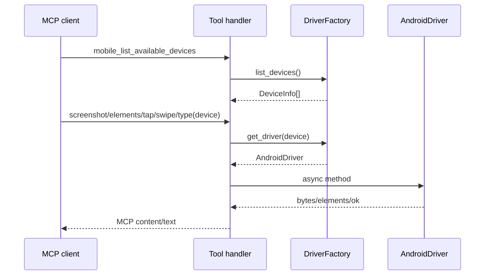

# android-live-ui-slice Design

## 0. 术语约定

| 术语 | 定义 | 防冲突结论 |
|---|---|---|
| Android live slice | 依赖真实已授权 Android 设备的最小 UI 自动化闭环 | 不包含 app 安装/启动、orientation、recording、crash |
| elements | `mobile_list_elements_on_screen` 返回的过滤后 accessibility 元素列表 | raw XML 仅内部使用，不公开 page source tool |
| live smoke | 在用户已连接真机上执行的一组 MCP tool 调用证据 | skip 不能算通过 |

## 1. 决策与约束

### 需求摘要

本 feature 在已完成 registry scaffold 后，把 Android 真机接入 `mobile_list_available_devices`、`mobile_get_screen_size`、`mobile_take_screenshot`、`mobile_list_elements_on_screen`、`mobile_click_on_screen_at_coordinates`、`mobile_double_tap_on_screen`、`mobile_long_press_on_screen_at_coordinates`、`mobile_swipe_on_screen`、`mobile_type_keys`。成功标准是用户已连接 Android 真机能通过 MCP 工具完成 `list_devices → screen_size → screenshot → elements → tap/swipe/type`。

### 明确不做

- 不实现 Android app lifecycle、orientation、button、open_url、save_screenshot。
- 不实现 recording/crash。
- 不公开 raw XML/page source 工具。
- 不做 iOS。

### 复杂度档位

走“设备外部依赖 + live smoke”档位；偏离默认点是必须区分 unit/contract tests 与真实设备 live smoke，不能把设备缺失 skip 记为验收通过。

### 关键决策

- Android driver 用 `uiautomator2` 做交互和截图；设备发现可用 `adbutils` 或 uiautomator2 设备列表，具体实现阶段选择最短可靠路径。
- 阻塞调用一律包进 `asyncio.to_thread()`，保持 driver contract async。
- elements 输出字段对齐 mobile-mcp：`type/text/label/name/value/identifier/coordinates/focused`，coordinates 来自 rect。

### 基线风险 / 必跑命令

- 需要先跑 `python -m pytest` 区分单测基线。
- live smoke 必须有真实 device id；如果设备不可用，本 feature acceptance blocked。
- 必跑：`python -m pytest`；Android live smoke 脚本/手工 MCP 调用。

### Top 3 风险

1. `uiautomator2` 的 screenshot/source API 与设备状态相关 → live smoke 先覆盖 screenshot/elements。
2. 文本输入非 ASCII 不稳定 → 首轮 smoke 使用 ASCII，非 ASCII 写入已知限制。
3. 坐标操作可能误触 → smoke 选择安全页面/坐标，记录实际 device id 和截图证据。

### 交付物与清洁度

- 交付物：`AndroidDriver` 核心 UI 方法、device discovery、对应 tool handlers、live smoke 说明/证据。
- 清洁度：不允许硬编码用户设备 id；不允许在 registry 层 import `uiautomator2`；不提交临时截图文件，除非测试证据路径明确。

## 2. 名词与编排

### 2.1 名词层

**现状**：roadmap 约定 `BaseDriver` contract；当前仓库在此 feature 前应已有 ToolSpec registry 和 stub handlers，但 Android driver 仍未实现。

**变化**：

- 新增/填充 `AndroidDriver(BaseDriver)`：实现 `screenshot/get_elements_on_screen/get_screen_size/tap/double_tap/long_press/swipe/send_keys`。
- 新增 `AndroidDeviceDiscovery`：返回 `DeviceInfo` 列表，至少包含在线 Android 真机/模拟器。
- 修改相关 tool handlers：从 `not_implemented` 切换到 Android driver 调用。
- `ScreenElement` 转 MCP output：将 rect 转成 `coordinates` 字段。

**Interface 设计检查**：

- Module：Android driver 暴露 BaseDriver 方法，不暴露 u2 device 对象。
- Seam：tool handler 只依赖 DriverFactory；unit tests 可用 fake driver，live smoke 穿真实 AndroidDriver。
- Depth/locality：uiautomator2 API 变化集中在 AndroidDriver。
- Adapter：AndroidDriver 是真实 adapter。

### 2.2 编排层

**现状**：handlers 返回 not_implemented。

**变化**：Android device id 路由到 AndroidDriver；核心 UI tools 转成真实 driver 调用；driver 错误转 structured error。

**流程级约束**：找不到设备返回 `device_not_found`；driver 异常返回 `driver_error`；`mobile_take_screenshot` 返回 image content；elements 失败不 fallback 到纯视觉。

### 2.3 挂载点清单

- DriverFactory Android 分支：新增 Android device discovery 与 driver 创建。
- Android UI tool handlers：从 stub 切换到真实 driver。
- Live smoke 文档/测试入口：新增 Android MVP 复跑步骤。

### 2.4 推进策略

1. 发现设备：实现 Android discovery。退出信号：已连接设备出现在 `mobile_list_available_devices`。
2. 截图/尺寸：实现 `get_screen_size` 和 `take_screenshot`。退出信号：返回尺寸和有效 image content。
3. 元素列表：实现 `get_elements_on_screen`。退出信号：返回含 coordinates 的结构化元素列表。
4. 坐标交互：实现 tap/double/long/swipe。退出信号：safe coordinate 操作无 driver error。
5. 输入：实现 ASCII `type_keys` + submit。退出信号：焦点输入框可输入 ASCII 并可 Enter。
6. live smoke 证据：记录复跑步骤和实际结果。退出信号：完整链路证据落盘/写入报告。

### 2.5 结构健康度与微重构

##### 评估

- 文件级 — 预计修改新建的 `drivers/android.py`、tool handlers；无既有胖文件。
- 目录级 — `src/pymobile_mcp/drivers/` 和 `tools/` 在上一 feature 新建，文件数量少。

##### 结论：不做

原因：新增 Android adapter 和 handler 填充即可；本 feature 不需要先重组目录。

## 3. 验收契约

### 关键场景清单

1. 已授权 Android 设备连接 → `mobile_list_available_devices` 返回该设备，platform 为 `android`。
2. 调用 `mobile_get_screen_size` → 返回宽高文本或结构化内容，宽高为正数。
3. 调用 `mobile_take_screenshot` → 返回 MCP image content，mime type 合法。
4. 调用 `mobile_list_elements_on_screen` → 返回元素 JSON，至少包含 coordinates 字段。
5. 调用 tap/swipe/type → driver 调用成功，错误时返回 structured error。

### 明确不做的反向核对项

- 不出现公开 `mobile_get_page_source` tool。
- 不要求 app install/launch 通过。
- 不要求 iOS device 出现在 discovery 中。

### Acceptance Coverage Matrix

| Scenario | Covered By Step | Evidence Type | Command / Action | Core? |
|---|---|---|---|---|
| Android device discovery | S1 | live command | MCP `mobile_list_available_devices` | yes |
| screenshot and screen size | S2 | image/command | MCP screenshot + screen_size | yes |
| elements with coordinates | S3 | command output | MCP list_elements | yes |
| tap/swipe/type | S4/S5 | manual/live smoke | safe device interaction | yes |
| no page_source public tool | S3 | test | `python -m pytest` | yes |

### DoD Contract

| ID | 要求 | 证据 | 阻塞级别 |
|---|---|---|---|
| DOD-DESIGN-001 | design/review/checklist 通过 | design-review | blocking |
| DOD-IMPL-001 | Android UI driver 和 handlers 完成 | checklist / diff | blocking |
| DOD-REVIEW-001 | code review passed | review report | blocking |
| DOD-QA-001 | pytest + Android live smoke 通过 | QA report | blocking |
| DOD-ACCEPT-001 | 最小闭环证据和 roadmap 回写 | acceptance report | blocking |

Validation Commands:

| ID | 命令 | 目的 | 核心性 | 失败处理 |
|---|---|---|---|---|
| CMD-001 | `python -m pytest` | unit/contract regression | core | fix-or-block |
| CMD-ANDROID-001 | Android live smoke via MCP tools | 真机闭环 | core | fix-or-block |

Required Artifacts: pytest 输出、live smoke device id/步骤/结果、screenshot 证据、review/QA/acceptance。

## 4. 与项目级架构文档的关系

本 feature 验证 Android driver seam 和 live smoke 规则。acceptance 后建议沉淀 Android 真机调试前置条件到 attention 或 compound。
