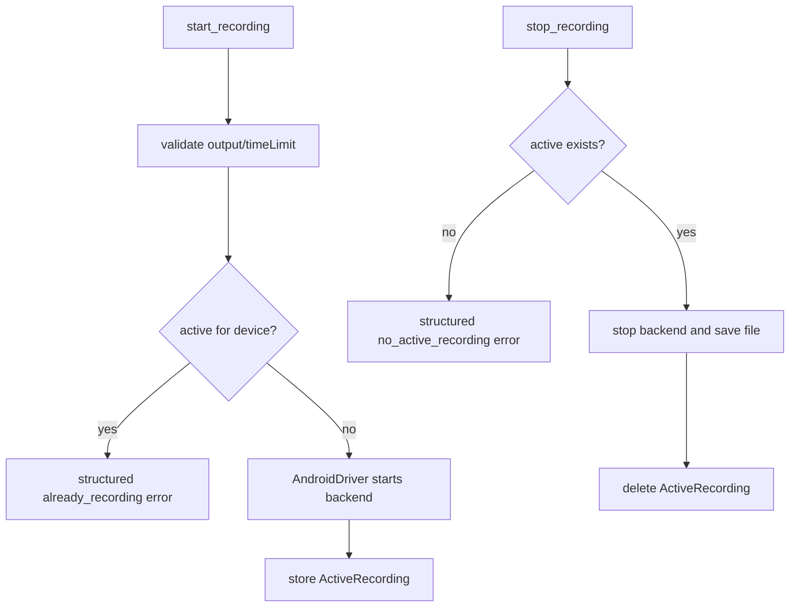

# android-recording-crash-tools Design

## 0. 术语约定

| 术语 | 定义 | 防冲突结论 |
|---|---|---|
| recording tools | `mobile_start_screen_recording` / `mobile_stop_screen_recording` | 每台设备同一时间只允许一个 recording |
| crash tools | `mobile_list_crashes` / `mobile_get_crash` | 若 Android 无可靠纯 Python/ADB 来源，返回 `unsupported_platform` |
| ActiveRecording | 进程内记录 device、output path、started_at、backend handle 的状态 | 不做跨进程恢复 |

## 1. 决策与约束

### 需求摘要

本 feature 补齐 Android recording/crash 工具。recording 首选通过 Android shell `screenrecord` 或 uiautomator2/adbutils 可控等价能力实现：start 立即返回，stop 保存到 host MP4。crash 工具必须先验证是否能可靠列出/读取 crash report；若无稳定来源，公开工具保持存在但对 Android 返回 `unsupported_platform`，不伪造空列表。

### 明确不做

- 不实现 iOS recording/crash。
- 不做跨进程恢复 active recording。
- 不新增后台 daemon 或设备农场。
- 不把 crash 工具成功定义成“返回空列表”来掩盖能力缺失。

### 复杂度档位

走“外部进程 + 文件输出 + 可降级能力”档位。偏离点是 recording 有跨调用状态，crash 可能需要明确 unsupported。

### 关键决策

- `active_recordings` 保持进程内 `dict[device_id, ActiveRecording]`，stop 或进程退出后不恢复历史状态。每设备 start/stop 用 `asyncio.Lock` 保护 check→start→store 和 stop→delete 序列，防止并发竞态。
- start 时校验 output 扩展名 `.mp4` 和安全 host path；未提供 output 时用 temp path。
- crash 能力以最小 spike 结果为准：能证明来源可靠才实现，否则返回 `unsupported_platform`。
- **Design-time default**：Android crash tools 默认返回 `unsupported_platform`，除非实现阶段 spike 证明有可靠纯 Python/ADB 来源。这个默认判定可在实现阶段被 spike 证据推翻。

### 基线风险 / 必跑命令

- 必跑 `python -m pytest`。
- Android live recording smoke 需要真实设备；无设备则 blocked。
- crash 工具必须有 spike/QA 证据说明“implemented”或“unsupported”的依据。

### Top 3 风险

1. `screenrecord` 停止/拉取文件不稳定 → stop 设置超时和清理状态。
2. output path 写入风险 → 复用 path validation。
3. crash 来源不可靠 → 不强行实现，返回稳定 unsupported 并记录限制。

### 交付物与清洁度

- 交付物：recording handlers、AndroidDriver recording 方法、active recording 状态、crash 工具实现或 unsupported 分支、live smoke/spike 记录。
- 清洁度：不遗留设备端临时 MP4；不硬编码 host path；不吞掉后台进程错误。

## 2. 名词与编排

### 2.1 名词层

**现状**：roadmap 定义了 `ActiveRecording` 共享状态；当前 Android app/system 已有 screenshot/path validation 能力。

**变化**：

- 新增 `ActiveRecording(device_id, output_path, started_at, backend_handle)`。`backend_handle` 由 driver 内部持有（如 subprocess handle），tool layer 只存 device_id→ActiveRecording 映射；driver 的 `stop_recording()` 通过内部状态找到 handle。
- AndroidDriver 补 `start_recording(output,time_limit)` / `stop_recording()`。
- Tool layer 维护每设备 recording 状态和 duplicate-start/no-active-stop 错误。
- Crash API 明确 `list_crashes() -> list[dict]`、`get_crash(id) -> str`；Android 实现或 unsupported 都要可测试。

**Interface 设计检查**：

- Module：Tool layer 管跨调用状态；AndroidDriver 管设备命令。
- Seam：recording state seam 在 tool execution layer，避免 driver 持有 MCP 进程全局状态。
- Depth/locality：screenrecord 细节和 crash 来源变化集中在 AndroidDriver。
- Adapter：继续使用 AndroidDriver。

### 2.2 编排层

**现状**：recording/crash handlers 未实现或 stub。

**变化**：recording tools 接入状态机；crash tools 根据 spike 接入实现或 unsupported。

**流程级约束**：duplicate start 和 no active stop 是业务错误；stop 必须清理状态；crash unsupported 要解释原因。

### 2.3 挂载点清单

- Tool execution shared state：新增 `active_recordings`。
- Android recording/crash handlers：从 stub 切换到 recording 实现/unsupported。
- AndroidDriver：新增 recording/crash 方法。
- Android recording/crash smoke/spike 文档入口。

### 2.4 推进策略

1. 状态与校验：实现 ActiveRecording 和 output/timeLimit validation。退出信号：unit tests 覆盖 duplicate/no-active/path。
2. Recording start/stop：接入 Android backend。退出信号：live smoke 生成 MP4 或明确 backend error。
3. 设备端清理：确保 stop/异常路径清理状态和临时文件。退出信号：重复 start/stop 行为可预测。
4. Crash spike：验证 Android crash 来源。退出信号：报告 implemented 或 unsupported 的证据。
5. Crash handler：实现读取或稳定 unsupported。退出信号：list/get crash 行为有测试/QA 证据。

### 2.5 结构健康度与微重构

##### 评估

- 文件级 — Tool execution layer 增加共享 recording 状态；若已有工具文件偏大，仍只新增一组相关函数。
- 目录级 — 不新增大量文件。

##### 结论：不做

原因：recording 状态是小型进程内状态；当前不需要抽持久 session 框架。

## 3. 验收契约

### 关键场景清单

1. start recording with safe output → 返回 started message 和 output path。
2. duplicate start on same device → 返回结构化错误，不启动第二个 recording。
3. stop active recording → 返回文件路径/大小/时长或可诊断错误，并清理状态。
4. stop without active recording → 返回结构化 no-active 错误。
5. crash list/get → 要么有真实 crash 证据，要么返回 `unsupported_platform`，不能伪造成功。

### 明确不做的反向核对项

- 不新增跨进程恢复文件。
- 不实现 iOS recording/crash。
- 不用空 crash list 代表“未支持”。

### Acceptance Coverage Matrix

| Scenario | Covered By Step | Evidence Type | Command / Action | Core? |
|---|---|---|---|---|
| recording start/stop | S2 | live command/file | MCP recording smoke | yes |
| duplicate/no-active errors | S1/S3 | test | `python -m pytest` | yes |
| safe output path | S1 | test | `python -m pytest` | yes |
| crash implemented or unsupported | S4/S5 | spike/QA report | crash tool call | yes |

### DoD Contract

| ID | 要求 | 证据 | 阻塞级别 |
|---|---|---|---|
| DOD-DESIGN-001 | design/review/checklist 通过 | design-review | blocking |
| DOD-IMPL-001 | recording 状态机和 crash 分支完成 | checklist / diff | blocking |
| DOD-REVIEW-001 | code review passed | review report | blocking |
| DOD-QA-001 | pytest + Android recording/crash smoke/spike 完成 | QA report | blocking |
| DOD-ACCEPT-001 | 能力状态和 roadmap 回写 | acceptance report | blocking |

Validation Commands:

| ID | 命令 | 目的 | 核心性 | 失败处理 |
|---|---|---|---|---|
| CMD-001 | `python -m pytest` | 状态机和 validation regression | core | fix-or-block |
| CMD-ANDROID-REC-001 | Android recording live smoke via MCP tools | 录屏真机验证 | core | fix-or-block |
| CMD-ANDROID-CRASH-001 | Android crash spike/tool call | crash 支持性判定 | core | document-or-block |

Required Artifacts: pytest 输出、recording 文件证据或错误、crash spike 结论、review/QA/acceptance。

## 4. 与项目级架构文档的关系

本 feature 会验证 recording 状态模型和 Android crash 支持边界。若 crash 选择 unsupported，应在 README 能力矩阵明确。
