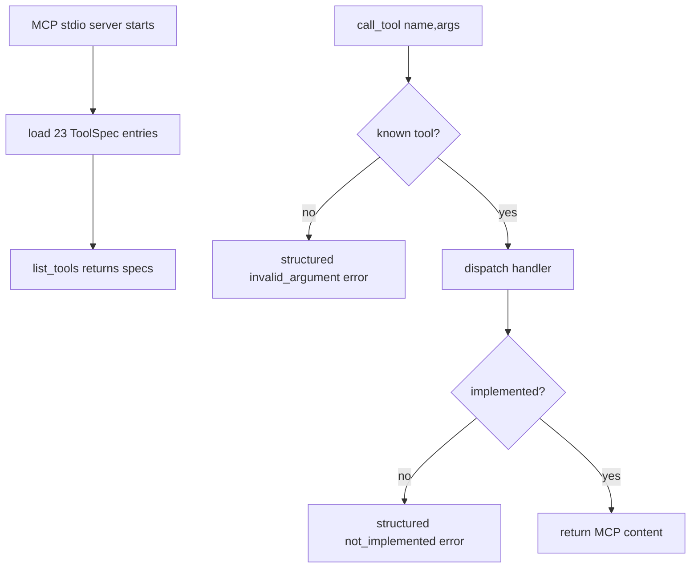

# contract-registry-scaffold Design

## 0. 术语约定

| 术语 | 定义 | 防冲突结论 |
|---|---|---|
| core tools | mobile-mcp 源码 `server.ts` 中不受 `MOBILEFLEET_ENABLE` 控制的 23 个常驻工具 | 不包含 remote fleet 3 个条件工具 |
| schema parity fixture | 本项目手写的 23 个工具名称、输入字段、必填/可选、枚举和 annotation 快照 | 以 `/Users/byte/workspace/forks/mobile-mcp/src/server.ts` 为事实源 |
| structured error | tool handler 对已知失败返回的 JSON text envelope | 不复刻 Python traceback，不伪装成功 |

## 1. 决策与约束

### 需求摘要

本 feature 建立最小 Python 包骨架和 MCP stdio server，使 MCP client 能列出 mobile-mcp 的 23 个常驻 core tools。真实设备能力暂不实现；所有未接通 handler 返回稳定结构化错误。成功标准是：`list_tools` 工具集合与 schema fixture 一致，任意未实现工具调用返回 `{status:"error", code:"not_implemented", tool, message, details}`。

### 明确不做

- 不公开 `mobile_get_page_source`。
- 不注册 `mobile_list_remote_devices` / `mobile_allocate_remote_device` / `mobile_release_remote_device`。
- 不接入真实 Android/iOS driver。
- 不在本 feature 实现录屏、截图、元素解析等设备能力。

### 复杂度档位

走“新后端工具包骨架”默认档位；唯一偏离是 **外部契约严格 parity**，因为工具名和 schema 必须对齐 mobile-mcp 源码，不能按 Kickoff 自行扩展。

### 关键决策

- 外部边界用 `ToolSpec + async handler`，工具实现可函数或类，不强制 one-class-per-tool。
- 工具 registry 数据集中在一个 manifest/fixture，server 注册从 manifest 读取，避免 23 个工具散落时字段 drift。
- `mobile_take_screenshot` 的 spec 标记为 image content handler；本阶段 handler 仍返回 not_implemented。

### 基线风险 / 必跑命令

- 当前仓库没有 `src/` / `tests/`，基线预检以 `python -m pytest` 为主；若 pytest 因无测试返回无用信号，contract test 创建后再作为核心命令。
- 必跑：`python -m pytest`、`python -m pymobile_mcp.cli --help` 或等价 CLI smoke（实现时选择真实入口）。

### Top 3 风险

1. MCP SDK API 用法和草案不一致 → 先写最小 `list_tools/call_tool` contract test。
2. schema 手抄字段漏掉 `bundle_id` / `saveTo` / `submit` 等特殊命名 → fixture 覆盖所有 23 个工具必填/可选字段。
3. 错误文本过度追求 mobile-mcp 原文导致不稳定 → 对已知错误固定 JSON envelope，README 后续说明差异。

### 交付物与清洁度

- 交付物：`src/pymobile_mcp/` 包、tool manifest、错误类型、CLI/server 入口、contract tests。
- 清洁度：不允许临时 debug print、注释掉代码、未使用 import、额外公开工具。

## 2. 名词与编排

### 2.1 名词层

**现状**：仓库只有 `pyproject.toml` 和 README，没有 `src/`、`tests/`、MCP server 或工具 registry。

**变化**：

- 新增 `ToolSpec(name,title,description,input_schema,annotations)`：承载 MCP 公开契约。
- 新增 `ToolResult` / MCP content 转换约定：text 工具返回 `TextContent`，截图工具预留 image content。
- 新增 `ToolError` 层级：`NotImplementedToolError`、`UnsupportedPlatformError`、`DeviceNotFoundError`、`InvalidArgumentError`、`DriverError`。
- 新增 schema parity fixture：23 个 core tool 的名称和参数来源于 mobile-mcp `server.ts`。

**Interface 设计检查**：

- Module：Tool Registry 暴露 `list_tool_specs()` 和 `call_tool(name,args)`。
- Seam：MCP SDK 只在 server 层，tool handler 可被 unit test 直接调用。
- Depth/locality：SDK 变化不影响 manifest；driver 变化不影响 schema fixture。
- Adapter：无额外 adapter。

### 2.2 编排层

**现状**：无 server 流程。

**变化**：新增 `PyMobileMCPServer` 负责 SDK 生命周期；新增 registry 负责工具查找和错误转换；每个 core tool 先挂 stub handler。

**流程级约束**：未知工具、未实现工具和 handler 异常都必须返回可预测错误；`list_tools` 不依赖设备环境。

### 2.3 挂载点清单

- CLI entry point：`pyproject.toml [project.scripts] pymobile-mcp` — 使用现有入口并补实现。
- MCP tool registry：23 个 mobile-mcp core tool name — 新增注册。
- Contract tests：`tests/` — 新增 parity 和 error envelope 测试入口。

### 2.4 推进策略

1. 包骨架：创建 `src/pymobile_mcp/`、CLI、server 空壳。退出信号：CLI help/server import 不报错。
2. ToolSpec manifest：录入 23 个 core tools。退出信号：contract test 比对工具名通过。
3. handler/stub：所有工具可调用并返回结构化 `not_implemented`。退出信号：抽样调用任一未实现工具得到固定 envelope。
4. schema parity：补字段、枚举、annotations fixture。退出信号：23 个工具 schema fixture 全通过。
5. 错误转换：统一异常到 MCP text content。退出信号：未知工具/未实现/invalid argument 场景测试通过。

### 2.5 结构健康度与微重构

##### 评估

- 文件级 — 无既有源码文件需要修改，`pyproject.toml` 仅保留现有 script 入口。
- 目录级 — `src/` 和 `tests/` 不存在，是全新目录；不存在目录摊平。

##### 结论：不做

原因：本 feature 是新骨架，当前没有胖文件或拥挤目录可重构；直接按 `server / tools / drivers` 分层建目录。

## 3. 验收契约

### 关键场景清单

1. 触发 `list_tools` → 返回 23 个 mobile-mcp 常驻 core tools，且不包含 remote fleet 和 `mobile_get_page_source`。
2. 调用任一未实现工具 → 返回 JSON text error，`code=not_implemented` 且 `tool` 为原工具名。
3. schema fixture 校验 → `bundle_id`、`saveTo`、`submit`、`orientation`、`direction` 等字段与 mobile-mcp 源码一致。
4. CLI smoke → `pymobile-mcp` 入口可导入/显示 help 或启动到可测试 server 对象。

### 明确不做的反向核对项

- `list_tools` 结果不应包含 `mobile_get_page_source`。
- `list_tools` 默认不应包含 remote fleet 三工具。
- 本 feature 不应 import `uiautomator2` 或 `pymobiledevice3` 到 tool registry 层。

### Acceptance Coverage Matrix

| Scenario | Covered By Step | Evidence Type | Command / Action | Core? |
|---|---|---|---|---|
| 23 core tools listed | S2/S4 | test | `python -m pytest` | yes |
| stub error envelope | S3/S5 | test | `python -m pytest` | yes |
| no page_source/remote tools | S2/S4 | test | `python -m pytest` | yes |
| CLI/server import smoke | S1 | command | `python -m pytest` or CLI help | yes |

### DoD Contract

| ID | 要求 | 证据 | 阻塞级别 |
|---|---|---|---|
| DOD-DESIGN-001 | design/review/checklist 通过 | design-review | blocking |
| DOD-IMPL-001 | registry、stub、fixture、tests 落盘 | checklist / diff | blocking |
| DOD-REVIEW-001 | code review 无 unresolved blocking | review report | blocking |
| DOD-QA-001 | contract tests 和 CLI smoke 通过 | QA report | blocking |
| DOD-ACCEPT-001 | roadmap item 回写 | acceptance report | blocking |

Validation Commands:

| ID | 命令 | 目的 | 核心性 | 失败处理 |
|---|---|---|---|---|
| CMD-001 | `python -m pytest` | contract/error/CLI smoke | core | fix-or-block |
| CMD-002 | `python -m pip install -e .` | 包安装入口可用 | supporting | fix-or-block |

Required Artifacts: design-review、review、QA、acceptance、pytest 输出、schema fixture diff。

## 4. 与项目级架构文档的关系

本 feature 会形成稳定术语：core tools、ToolSpec、structured error。acceptance 后若实现形态稳定，建议把“strict mobile-mcp parity / no page_source public tool”沉淀到 README 或 compound；不直接写 ADR。
