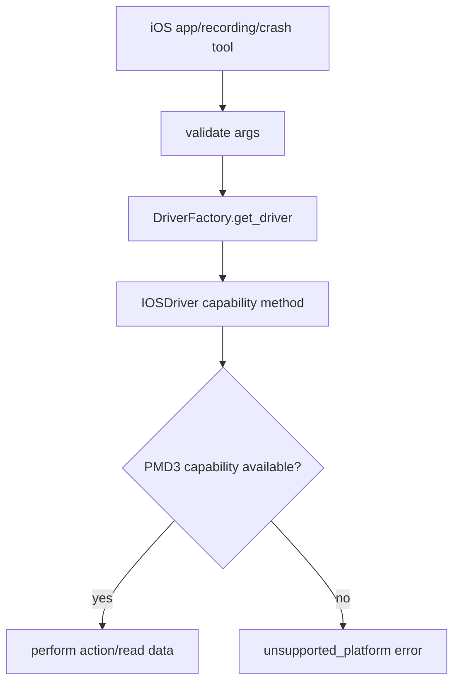

# ios-app-recording-crash-parity Design

## 0. 术语约定

| 术语 | 定义 | 防冲突结论 |
|---|---|---|
| iOS parity tools | iOS 侧 app lifecycle、recording、crash 对 mobile-mcp core tools 的补齐 | 不改变对外 schema |
| stable unsupported | 平台/环境能力不可用时返回结构化 `unsupported_platform` | 不用空结果伪装成功 |
| PMD3 capability spike | 针对 pymobiledevice3 是否支持某类能力的最小验证 | spike 结果决定实现或降级 |

## 1. 决策与约束

### 需求摘要

本 feature 在 `ios-pmd3-wda-core` 完成后，补齐 iOS app lifecycle、recording 和 crash 工具，或在 PMD3 无可靠能力时给出稳定 unsupported 行为。成功标准是所有 mobile-mcp core tools 在 iOS 设备上要么可用，要么有可解释、可测试的降级。

### 明确不做

- 不引入 go-ios / mobilecli。
- 不改变字段名：`packageName`、`bundle_id`、`locale?`、`output`、`timeLimit`、`id`。
- 不把环境缺失、签名缺失或 PMD3 能力缺口伪装成成功。
- 不做跨进程 recording 恢复。

### 复杂度档位

走“平台能力 parity + 可降级”档位；每组能力先做 PMD3 capability spike，再决定实现或 unsupported。

### 关键决策

- app lifecycle、recording、crash 都通过 IOSDriver 暴露 BaseDriver 方法，tool layer 不关心 PMD3 细节。
- recording 复用 roadmap 的 `ActiveRecording` 进程内状态语义。
- crash 支持必须有真实列表/读取来源；否则返回 unsupported 并在 README 能力矩阵记录。

### 基线风险 / 必跑命令

- 必跑 `python -m pytest`。
- iOS live smoke 需要真实 iOS + WDA/PMD3 环境；缺环境时标 blocked-by-env，不能把环境缺失等同于 stable unsupported。只有 capability spike 证明 PMD3/平台无可靠能力时，才能落到 stable `unsupported_platform`。
- 每组能力都要有 spike/QA 证据。

### Top 3 风险

1. PMD3 app install/list API 版本差异 → 用 spike 确认可用调用后再实现。
2. iOS recording 可能依赖外部服务或不可控路径 → 不能可靠保存 MP4 时 stable unsupported。
3. iOS crash report 权限/路径不稳定 → 不能读取完整内容时 stable unsupported。

### 交付物与清洁度

- 交付物：IOSDriver app/recording/crash 方法、tool handlers iOS 分支、spike 记录、能力矩阵候选。
- 清洁度：不提交 UDID/证书/设备私有 crash 内容；不引入 go-ios；不硬编码 bundle id。

## 2. 名词与编排

### 2.1 名词层

**现状**：iOS core driver 已接通 UI 基础能力；app/recording/crash 仍未实现或 unsupported。

**变化**：

- IOSDriver 补 `list_apps/launch_app/terminate_app/install_app/uninstall_app` 或 stable unsupported。
- IOSDriver 补 `start_recording/stop_recording` 或 stable unsupported。
- IOSDriver 补 `list_crashes/get_crash` 或 stable unsupported。
- Tool layer 复用 Android recording 状态机和输出路径校验。

**Interface 设计检查**：

- Module：IOSDriver 持有 PMD3 能力细节；tool layer 只处理 schema 和 error envelope。
- Seam：每组 capability 以 IOSDriver 方法为 seam，测试可 fake。
- Depth/locality：PMD3 版本差异集中在 IOSDriver。
- Adapter：继续使用 IOSDriver。

### 2.2 编排层

**现状**：iOS core tools 可用后，非 core UI tools 仍可能未实现。

**变化**：每个 parity tool 通过 capability spike 决定实现或 unsupported；错误路径可测试。

**流程级约束**：unsupported 必须说明缺口；recording duplicate/no-active 语义与 Android 一致；host output path 仍受安全限制。

### 2.3 挂载点清单

- IOSDriver app/recording/crash 方法。
- Existing app/recording/crash handlers：iOS 分支从 stub/unsupported 切换到实现或稳定 unsupported。
- iOS parity spike/smoke 文档入口。

### 2.4 推进策略

1. capability spikes：分别验证 app lifecycle、recording、crash。退出信号：每组有 implemented/unsupported 证据。
2. app lifecycle：实现或 stable unsupported。退出信号：list_apps/launch/terminate 等行为可测试。
3. recording：实现或 stable unsupported。退出信号：start/stop 状态机与 path validation 通过。
4. crash：实现或 stable unsupported。退出信号：list/get crash 行为有证据。
5. 能力矩阵候选：记录 iOS 支持状态和限制。退出信号：parity-hardening 可直接收口。

### 2.5 结构健康度与微重构

##### 评估

- 文件级 — `drivers/ios.py` 会增加 app/recording/crash 方法；职责仍是 iOS adapter。
- 目录级 — 不新增大量文件。

##### 结论：不做

原因：这些能力属于同一 iOS platform adapter；先不抽 capability 子模块，避免空转 pass-through。

## 3. 验收契约

### 关键场景清单

1. iOS app lifecycle tools 要么可执行，要么返回 stable unsupported。
2. iOS recording start/stop 要么生成可核验 MP4，要么 stable unsupported。
3. iOS crash list/get 要么返回真实 crash 数据，要么 stable unsupported。
4. 不引入 go-ios 依赖。
5. README 能力矩阵候选记录 iOS 支持/限制。

### 明确不做的反向核对项

- 不新增 go-ios / mobilecli dependency。
- 不提交设备私密 crash 内容。
- 不改变 public tool schema。

### Acceptance Coverage Matrix

| Scenario | Covered By Step | Evidence Type | Command / Action | Core? |
|---|---|---|---|---|
| app lifecycle implemented/unsupported | S1/S2 | smoke/spike | iOS app tool calls | yes |
| recording implemented/unsupported | S1/S3 | smoke/spike | iOS recording tool calls | yes |
| crash implemented/unsupported | S1/S4 | smoke/spike | iOS crash tool calls | yes |
| no go-ios dependency | S2-S4 | diff/test | dependency check | yes |
| ability matrix candidate | S5 | doc diff | README/matrix draft | yes |

### DoD Contract

| ID | 要求 | 证据 | 阻塞级别 |
|---|---|---|---|
| DOD-DESIGN-001 | design/review/checklist 通过 | design-review | blocking |
| DOD-IMPL-001 | iOS parity 分支实现或 stable unsupported | checklist / diff | blocking |
| DOD-REVIEW-001 | code review passed | review report | blocking |
| DOD-QA-001 | pytest + iOS parity smoke/spike | QA report | blocking |
| DOD-ACCEPT-001 | 能力状态和 roadmap 回写 | acceptance report | blocking |

Validation Commands:

| ID | 命令 | 目的 | 核心性 | 失败处理 |
|---|---|---|---|---|
| CMD-001 | `python -m pytest` | regression | core | fix-or-block |
| CMD-IOS-PARITY-001 | iOS app/recording/crash smoke or unsupported checks | iOS parity 验证 | core | fix-or-block-or-document-unsupported |

Required Artifacts: pytest 输出、iOS capability spike 记录、能力矩阵候选、review/QA/acceptance。

## 4. 与项目级架构文档的关系

本 feature 会确定 iOS 非 UI core 能力边界。支持矩阵和 unsupported 原因应进入 README；PMD3 能力经验可沉淀到 compound。
