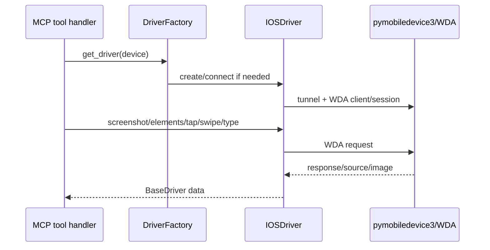

# ios-pmd3-wda-core Design

## 0. 术语约定

| 术语 | 定义 | 防冲突结论 |
|---|---|---|
| PMD3 | `pymobiledevice3`，负责 iOS 设备发现、tunnel、DVT/WDA 相关能力 | 不使用 go-ios 作为运行时依赖 |
| WDA core | WebDriverAgent 的 screenshot/source/tap/swipe/type/orientation 基础能力 | app/recording/crash 后续条目处理 |
| source tree | WDA 内部 `/source` JSON，用于过滤 elements | 不公开 raw source tool |

## 1. 决策与约束

### 需求摘要

本 feature 在已稳定 MCP 契约后，打通 iOS 核心 UI 自动化：设备发现、WDA/tunnel 连接、截图、元素列表、tap/double/long press、swipe、type、screen size、orientation。成功标准是有 iOS 环境时可通过同一套 mobile-mcp tools 跑通核心 UI smoke；没有 iOS 环境时必须明确 blocked，不能伪装通过。

### 明确不做

- 不使用 go-ios 或 mobilecli 作为运行时依赖。
- 不实现 iOS app lifecycle、recording、crash。
- 不公开 raw WDA source。
- 不在 roadmap 内提前解决 WDA 签名/安装的所有环境问题；缺环境时记录阻塞。

### 复杂度档位

走“高风险外部设备 + spike-first”档位。偏离点是 PMD3/WDA API 真实性必须先用最小 live/spike 验证。

### 关键决策

- iOS driver 和 Android driver 实现同一 `BaseDriver` contract；tool layer 不分叉 schema。
- WDA source 只用于 `mobile_list_elements_on_screen` 的内部过滤。
- 若 PMD3 的 `WdaServiceClient` 某能力缺口明确，优先稳定 `unsupported_platform`/`driver_error`，不引入 go-ios 回退。

### 基线风险 / 必跑命令

- 必跑 `python -m pytest`。
- iOS live/spike：至少验证 PMD3 设备发现、WDA client 创建、screenshot 或 screen size 任一真实调用。
- 无 iOS 设备/WDA 环境时，本 feature implementation/QA 必须 blocked 或用户明确调整范围。

### Top 3 风险

1. PMD3 WDA API 与 kickoff 伪代码不一致 → 第一实现步就是 spike。
2. iOS 17+ tunnel/配对/权限复杂 → 失败时记录具体前置，不吞成 generic error。
3. WDA element source 坐标/字段和 Android 不同 → 统一在 iOSDriver 内映射成 `ScreenElement`。

### 交付物与清洁度

- 交付物：`IOSDriver` core 方法、iOS discovery、WDA/tunnel 连接管理、iOS core live/spike 记录。
- 清洁度：不提交证书/UDID 私密信息；不硬编码设备 id；不引入 go-ios。

## 2. 名词与编排

### 2.1 名词层

**现状**：roadmap 定义 iOS driver 目标；现有实现到本条前应有 registry、DriverFactory、Android driver，但 iOS driver 仍未接通。

**变化**：

- 新增 `IOSDriver(BaseDriver)`：实现 discovery、connect/disconnect、screenshot、elements、screen size、tap/swipe/type、orientation。
- 新增 iOS WDA session/tunnel 状态：driver 内部持有 PMD3 tunnel / WDA client，不暴露到 tool layer。
- 新增 WDA source → `ScreenElement` 映射：type/label/name/value/identifier/rect/focused。
- DriverFactory 增加 iOS discovery 和 driver 创建。

**Interface 设计检查**：

- Module：IOSDriver 暴露 BaseDriver，不暴露 WDA client。
- Seam：driver 内部封装 tunnel/WDA session；unit tests 可用 fake driver，live smoke 穿真实 IOSDriver。
- Depth/locality：PMD3 API 变动集中在 IOSDriver。
- Adapter：IOSDriver 是真实 adapter。

### 2.2 编排层

**现状**：iOS devices either absent from discovery or return not_implemented.

**变化**：iOS discovery returns DeviceInfo; iOS core tools route through IOSDriver; WDA/source errors become structured driver errors.

**流程级约束**：connect failure must be actionable; raw source not exposed; live smoke requires real environment evidence.

### 2.3 挂载点清单

- DriverFactory iOS branch：新增 iOS discovery 和 driver 创建。
- IOSDriver：新增 core UI 方法。
- Existing core UI tool handlers：platform lookup 后可调用 iOS driver。
- iOS core live/spike evidence path/documentation.

### 2.4 推进策略

1. PMD3/WDA spike：验证 device discovery + WDA/screenshot 或 screen size。退出信号：有真实调用证据或明确 blocked 原因。
2. 连接生命周期：实现 connect/disconnect/tunnel/WDA client 管理。退出信号：重复调用可复用或安全重连。
3. screenshot/screen size/orientation：实现只读能力。退出信号：live smoke 返回有效值。
4. elements：实现 WDA source 过滤成 ScreenElement。退出信号：返回含 coordinates 的元素列表。
5. interactions：实现 tap/double/long/swipe/type。退出信号：safe iOS live smoke 无 driver_error。
6. 证据与限制：记录 iOS 前置和复跑步骤。退出信号：QA/acceptance 可复核。

### 2.5 结构健康度与微重构

##### 评估

- 文件级 — 新增 `drivers/ios.py`，不修改既有胖文件。
- 目录级 — `drivers/` 目标目录已有 Android/base/factory，iOS 是对称 adapter，不摊平。

##### 结论：不做

原因：新增一个真实平台 adapter 是预期结构，不需要额外抽象。

## 3. 验收契约

### 关键场景清单

1. iOS device discovery → 返回 platform `ios` 的 DeviceInfo，或明确环境阻塞。
2. WDA connect spike → screenshot 或 screen size 至少一个真实调用成功，或 blocked 原因可复现。
3. `mobile_take_screenshot` / `mobile_get_screen_size` 对 iOS 返回有效结果。
4. `mobile_list_elements_on_screen` 对 iOS 返回过滤元素和 coordinates。
5. tap/swipe/type 对 iOS safe smoke 成功或返回 structured driver error。

### 明确不做的反向核对项

- 不 import/go 调用 go-ios。
- 不公开 mobile_get_page_source。
- 不实现 iOS app/recording/crash。

### Acceptance Coverage Matrix

| Scenario | Covered By Step | Evidence Type | Command / Action | Core? |
|---|---|---|---|---|
| PMD3/WDA spike | S1 | live/spike report | iOS device smoke | yes |
| iOS discovery | S2 | live command | MCP list_devices | yes |
| screenshot/size/orientation | S3 | image/command | MCP tools | yes |
| elements | S4 | command output | MCP list_elements | yes |
| interaction tools | S5 | live smoke | safe iOS actions | yes |

### DoD Contract

| ID | 要求 | 证据 | 阻塞级别 |
|---|---|---|---|
| DOD-DESIGN-001 | design/review/checklist 通过 | design-review | blocking |
| DOD-IMPL-001 | IOSDriver core 完成或明确环境阻塞 | checklist / diff | blocking |
| DOD-REVIEW-001 | code review passed | review report | blocking |
| DOD-QA-001 | pytest + iOS core smoke/spike | QA report | blocking |
| DOD-ACCEPT-001 | 能力状态和 roadmap 回写 | acceptance report | blocking |

Validation Commands:

| ID | 命令 | 目的 | 核心性 | 失败处理 |
|---|---|---|---|---|
| CMD-001 | `python -m pytest` | regression | core | fix-or-block |
| CMD-IOS-CORE-001 | iOS PMD3/WDA core live smoke | iOS 核心链路 | core | fix-or-block-or-document-environment-blocker |

Required Artifacts: pytest 输出、iOS spike/live smoke 记录、环境阻塞详情（如有）、review/QA/acceptance。

## 4. 与项目级架构文档的关系

若 PMD3 + WDA 路线验证成功，这是一条稳定结构性决策候选；acceptance 后建议通过 `cs-domain` 记录 ADR。失败则沉淀 compound learning。
