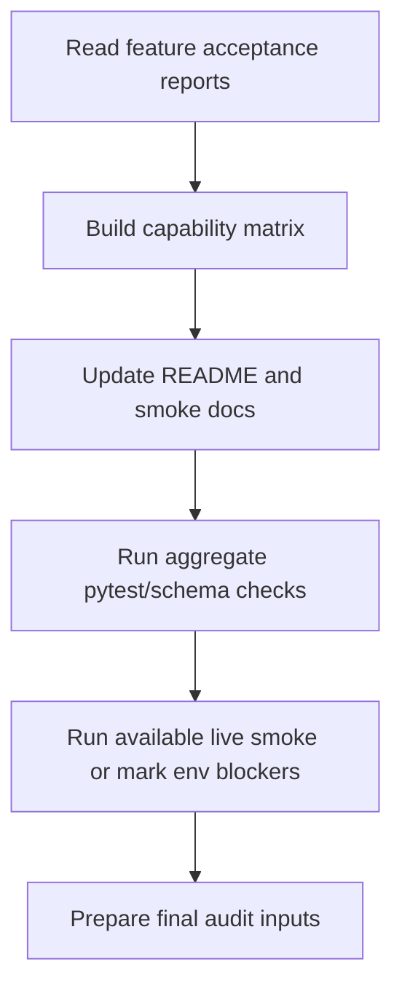

# parity-hardening-docs Design

## 0. 术语约定

| 术语 | 定义 | 防冲突结论 |
|---|---|---|
| parity matrix | 23 个 mobile-mcp 常驻 core tools 在 Android/iOS 的实现/unsupported 状态表 | 不包含 remote fleet 条件工具 |
| final aggregate checks | roadmap 完成前统一重跑的测试、schema、live smoke 或文档核验 | 不用单个 feature 的旧通过结果替代全部收口 |
| known limitations | 已验证存在的限制或环境前置 | 必须明确影响范围和复跑方式 |

## 1. 决策与约束

### 需求摘要

本 feature 在所有功能条目完成后，收口契约测试、README 能力矩阵、安装/调试说明、Android/iOS live smoke 文档和已知限制。成功标准是新用户能从 README 配置并理解当前支持状态；维护者能用 tests/fixture 发现 schema drift；roadmap completion 有最终聚合验证证据。

### 明确不做

- 不新增功能能力。
- 不把未验证能力写成 supported。
- 不把 remote fleet 三工具纳入默认 parity matrix。
- 不自动写 ADR/compound；只提出候选。

### 复杂度档位

走“非功能性 hardening + 文档收口”档位；核心是证据完整和状态准确，不追求大文档系统。

### 关键决策

- README 能力矩阵按 tool × platform 展示：supported / unsupported / blocked-by-env。23 个 core tools 的每个平台格必须有一个明确状态，不允许用 not-applicable 消失。
- schema parity fixture 继续以 mobile-mcp `server.ts` 的已固定版本/快照为依据。
- live smoke 文档分 Android MVP、Android app/system/recording/crash、iOS core、iOS parity 四组，便于按环境复跑。

### 基线风险 / 必跑命令

- 必跑 `python -m pytest`。
- 必跑 YAML/CodeStable consistency：goal 最终审计会跑 `codestable-goal-consistency-gate.py`。
- live smoke 若缺设备，必须在矩阵中标 blocked-by-env，不可标 supported。

### Top 3 风险

1. 文档乐观标注能力 → 矩阵只读取 acceptance 事实，不凭实现意图。
2. schema fixture 上游 drift → 记录 mobile-mcp 参考路径/版本或快照来源。
3. live smoke 证据散落 → README/goal-audit 指向统一证据路径或 acceptance 报告。

### 交付物与清洁度

- 交付物：README 能力矩阵、安装/配置说明、live smoke 说明、schema parity tests/fixture 收口、最终验证报告输入。
- 清洁度：不复制大段源码；不提交设备私密信息；不写未经验证的成功声明。

## 2. 名词与编排

### 2.1 名词层

**现状**：README 只有 Quick Start 和 License；各 feature acceptance 分散记录能力状态。

**变化**：

- 新增/更新 README：安装、MCP client 配置、Android/iOS 前置、能力矩阵、live smoke、已知限制。
- 收口 schema parity fixture：明确 23 个 core tools 和排除 remote/page_source。
- 新增 final aggregate check 列表：pytest、schema parity、可用设备 live smoke、CodeStable consistency gate。
- 汇总 knowledge candidates：Android/u2、PMD3/WDA、unsupported crash/recording 限制。

**Interface 设计检查**：

- Module：文档和 tests 是验证/说明层，不改变 runtime interface。
- Seam：schema fixture 是防 drift seam；README 是用户入口。
- Depth/locality：parity 规则集中在 fixture 和矩阵。
- Adapter：不适用。

### 2.2 编排层

**现状**：各能力实现/unsupported 状态分散在 feature reports。

**变化**：统一收口为 README/fixture/goal audit 输入。

**流程级约束**：文档状态必须能追溯到 acceptance 证据；blocked-by-env 和 unsupported 必须区分；remote fleet 不属于默认 parity。

### 2.3 挂载点清单

- README：新增能力矩阵、安装/调试/live smoke/限制。
- Tests/fixtures：收口或新增 schema parity fixture。
- Goal audit input：最终聚合命令和证据路径。

### 2.4 推进策略

0. 依赖就绪检查：验证所有前置 feature 已 accepted/done，acceptance/QA artifact 存在。退出信号：items.yaml 中所有依赖项 status=done；否则 blocked。
1. 事实收集：读取所有 acceptance/QA 结论。退出信号：每个 item 有 supported/unsupported/blocked 状态来源。
2. 能力矩阵：生成 23 tools × platforms 表。退出信号：每格可追溯到证据。
3. 文档更新：补 README 和 live smoke 说明。退出信号：新用户能按文档配置和复跑。
4. 聚合验证：跑 pytest/schema/可用 live smoke/consistency gate。退出信号：命令输出可引用。
5. 收尾候选：列 ADR/compound/attention 候选。退出信号：goal audit 可消费。

### 2.5 结构健康度与微重构

##### 评估

- 文件级 — README 会变长但仍是项目入口；若超过可读范围，可拆 `docs/`，但当前仓库文档很少。
- 目录级 — `tests/` 可能已有 fixture；不预计目录摊平。

##### 结论：不做

原因：先把最小项目说明集中在 README；只有 README 过长或用户要求外部分层文档时再拆 docs。

## 3. 验收契约

### 关键场景清单

1. README 能力矩阵列出 23 个 core tools，排除 remote fleet 和 page_source。
2. 每个 Android/iOS 状态有 acceptance/QA 证据来源。
3. schema parity tests 在最终运行中通过。
4. live smoke 文档能复跑可用设备场景；缺设备标 blocked-by-env。
5. final aggregate check 输出可供 goal audit 引用。

### 明确不做的反向核对项

- README 不声称 remote fleet 支持。
- README 不声称 unsupported/blocked 能力 supported。
- 不写入设备私密标识、证书或 crash 内容。

### Acceptance Coverage Matrix

| Scenario | Covered By Step | Evidence Type | Command / Action | Core? |
|---|---|---|---|---|
| capability matrix accuracy | S1/S2 | diff review | README matrix vs acceptance | yes |
| schema parity | S4 | command | `python -m pytest` | yes |
| live smoke docs | S3/S4 | doc + command | README smoke steps | yes |
| final audit inputs | S4/S5 | command/report | consistency gate + pytest | yes |
| knowledge candidates | S5 | review note | acceptance summary | no |

### DoD Contract

| ID | 要求 | 证据 | 阻塞级别 |
|---|---|---|---|
| DOD-DESIGN-001 | design/review/checklist 通过 | design-review | blocking |
| DOD-IMPL-001 | README/tests/smoke docs 更新 | checklist / diff | blocking |
| DOD-REVIEW-001 | code review/docs review passed | review report | blocking |
| DOD-QA-001 | aggregate checks 通过或 env blocker 明确 | QA report | blocking |
| DOD-ACCEPT-001 | roadmap 最终收口输入齐全 | acceptance report | blocking |

Validation Commands:

| ID | 命令 | 目的 | 核心性 | 失败处理 |
|---|---|---|---|---|
| CMD-001 | `python -m pytest` | 全量测试和 schema parity | core | fix-or-block |
| CMD-GOAL-001 | `python3 .codestable/tools/codestable-goal-consistency-gate.py --roadmap .codestable/roadmap/pymobile-mcp-android-mvp/pymobile-mcp-android-mvp-roadmap.md` | goal consistency | core | fix-or-block |
| CMD-LIVE-AVAILABLE | available Android/iOS live smoke from README | 已具备设备的端到端验证 | core | fix-or-block-or-document-env-blocker |

Required Artifacts: README diff、pytest 输出、consistency gate 输出、live smoke 证据/blocked 说明、schema fixture source metadata (mobile-mcp server.ts path + git revision)、knowledge candidates。

## 4. 与项目级架构文档的关系

本 feature 是收口层，会提出 `cs-domain` / `cs-keep` 候选：strict parity 契约、Android live smoke 前置、PMD3/WDA 决策、unsupported 能力边界。是否落 ADR/compound 由最终 acceptance 后用户确认。
