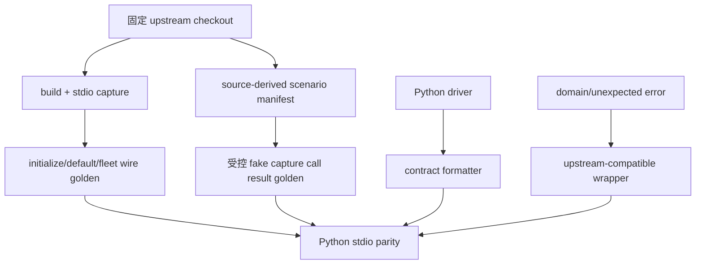

# mobile-mcp-black-box-contract-parity Design

## 0. 术语约定

| 术语 | 定义 | 防冲突结论 |
|---|---|---|
| black-box contract | MCP client 可观察到的全部外部表面：`initialize`、tool 集合、title/description、input schema、annotations、content、错误文本、`isError`、条件工具开关 | 不包含 Python/TypeScript 内部实现栈；包含用户实际看到的提示词、入参与回参 |
| upstream oracle | 固定上游 `/Users/byte/workspace/forks/mobile-mcp` commit `c5d7d27fd61e4762e15ae4b1c68b6c011be88bb7` | `git describe=0.0.61` 是源码 revision/tag；MCP wire advertised version 由 `package.json` 决定，为 `0.0.1` |
| source-derived contract | 直接从上游 `src/server.ts` 复制的工具名、title、description、参数 description、return template、ActionableError wrapper 和 image 分支 | 替代当前只保存 required/optional 摘要的 fixture |
| wire golden | 固定 probe client 下，上游真实 stdio 返回的完整 `InitializeResult` + default/fleet `ListToolsResult`，以及受控 fake 环境下的 `CallToolResult` | 只允许 JSON object key canonicalization；保留 array/tool 顺序、缺字段与 `null`、字符串逐字差异 |
| scenario manifest | `.codestable/features/2026-07-12-mobile-mcp-black-box-contract-parity/mobile-mcp-black-box-contract-parity-scenarios.yaml` 中逐 return-site/公开分支的覆盖清单 | 每个上游 return branch、optional/default/coercion 与错误类别都必须有 expected 和证据 |
| conditional tools | `MOBILEFLEET_ENABLE=1` 时额外注册的 remote fleet 三工具 | discovery 必须对齐；runtime 不能复刻时只能走用户批准的 exception |
| exception ledger | `.codestable/features/2026-07-12-mobile-mcp-black-box-contract-parity/mobile-mcp-black-box-contract-parity-exceptions.yaml` 中的具体外部行为豁免 | 当前两项均已由用户批准；implementation/acceptance 只能在精确 scope 内计为 approved exception |

## 1. 决策与约束

### 需求摘要

本 feature 把 `pymobile-mcp` 做成 `mobile-mcp` 的黑盒替代：除实现栈从 TypeScript/mobilecli/go-ios 变为 Python/uiautomator2/pymobiledevice3/WDA 外，MCP client 看到的 server info、工具、工具提示词、入参、出参、错误语义和条件工具行为应与固定上游一致。成功标准不是“当前 Python 测试通过”，而是固定上游源码 + 真实 stdio wire golden 能证伪，Python 对同一 scenario manifest 逐项相等；任何能力差异必须在 exception ledger 中具体化并由用户批准。

### 明确不做

- 不改变内部实现栈：不引入 go-ios / mobilecli 作为 runtime fallback。
- 不把当前 Python-native JSON success/error envelope 保留为默认 public contract。
- 不用 Python specs 反向生成上游 expected，不用摘要 fixture 自证 parity。
- 不自动更新 golden；更新必须显式命令、provenance 校验和人工 diff review。
- 不把设备缺失、destructive 未授权、iOS recording 未实现或 fleet backend 缺失伪装成 pass。
- 不在本 feature 引入 TypeScript AST/codegen；固定版本下保持人工可审的 source manifest。

### 复杂度档位

- 健壮性 = L3：外部输入和所有公开失败路径都要稳定对齐。
- 可演进性 = frozen：本轮锁定上游 commit，Python 侧不得自由漂移。
- 可测试性 = verified：golden、逐 return-site matrix、stdio、Pi/live 证据缺一不可。
- 兼容性 = cross-version/current-upstream-pinned：后续升级通过显式 snapshot 流程。

### 关键决策

1. **源码复制是主方案**：`server.ts` 是工具文字、参数文字、返回模板和 error wrapper 的事实源。
2. **真实 stdio 是权威 gate**：source extraction 不能替代 SDK validation/serialization；上游无法构建/启动或受控 call capture 超时时，本 feature 为 blocked，不能宣称 attested parity。
3. **wire advertised metadata 对齐**：`serverInfo.name=mobile-mcp`、`serverInfo.version=0.0.1`，完整 initialize capabilities/protocol 由 golden 锁定；Python package 版本仍可独立为 `0.2.x`。
4. **成功输出按上游原文**：除 screenshot image 和上游本来返回 JSON string/raw content 的工具外，text tools 使用上游自然语言模板。
5. **错误语义按上游 wrapper**：Actionable-like 错误为普通 text `... Please fix the issue and try again.` 且 `isError` 省略；普通异常为 `Error: ...` 且 `isError=true`；SDK/schema 错误以 wire capture 为准。
6. **条件工具 discovery 不豁免**：默认 23 tools；fleet env 为 26 tools。仅 remote fleet 成功 runtime 可进入 EXC-REMOTE-FLEET-RUNTIME 提案。
7. **设备类型分支也必须 exact**：Android physical 在固定上游公开为 `type=emulator`，Python public formatter 必须复刻；iOS Simulator discovery 用 Python 调用原生 `xcrun simctl`，设备 runtime 由 simulator WDA + `simctl` 承担，录屏用 `xcrun simctl io <udid> recordVideo`，不使用 go-ios/mobilecli，也不新增 simulator exception。实现受阻时 feature 保持 blocked。

### 方案深度 pre-pass

- A. 保留 Python JSON 仅补文档：违反黑盒不变，拒绝。
- B. 直接复制源码契约 + upstream wire golden + exhaustive scenario manifest：覆盖用户目标且可审，选择。
- C. TypeScript AST codegen：当前一份固定上游不值得维护生成器，暂不做。

### Exception ledger（已由用户在 design checkpoint 批准）

| ID | 精确范围 | Python 可观察行为 | `isError` | 影响 / 转正条件 |
|---|---|---|---|---|
| EXC-REMOTE-FLEET-RUNTIME | 仅 fleet env 下 list/allocate/release 的**成功 runtime**；tool discovery/schema 必须一致 | 无 Python fleet provider 时返回上游 mobilecli-unavailable ActionableError 全文；详见 exceptions.yaml | 省略 | 默认 23-tool 无差异；有 Python fleet provider 后移除 |
| EXC-IOS-SCREEN-RECORDING-RUNTIME | iOS start/stop recording 的成功 runtime；tool discovery/schema 必须一致 | `iOS screen recording is not available through pure pymobiledevice3/WDA yet. Please fix the issue and try again.` | 省略 | Android 不受影响；DisplayService 或 WDA finalize 可用后移除 |

两项 exception 已按表中精确范围批准；后续扩大 scope 必须重新获得用户批准，不得退回 JSON `unsupported_platform`。

### 基线风险 / 可执行验证入口

- 当前 `pytest` 47 passed 保护的是 Python-native 契约；切换 expected 会引发预期内的大量测试改动。
- 上游 `npx` probe 曾超时；实现必须从固定本地 checkout 构建并启动，不允许把 source extractor 降格成 wire 证明。
- 实现阶段固定创建：
  - `scripts/capture_mobile_mcp_contract.py`：build/start 上游，捕获 initialize/list_tools；
  - `scripts/capture_mobile_mcp_calls.py`：在 PATH/MOBILECLI_PATH/设备替身下捕获 scenario manifest 的 call results；
  - `scripts/assert_mobile_mcp_contract.py`：启动 Python stdio 对 golden/matrix deep-compare。
  - `scripts/run_with_timeout.py`：统一 core command timeout、0/1/2 exit 和 machine report；
  - `scripts/validate_mobile_mcp_source_coverage.py`：反查固定源码 return/validation/backend 分支与 scenario mapping；
  - `scripts/compare_mobile_mcp_image_backends.py`：产出 sips/ImageMagick/fallback upstream+Python decoded artifacts 和 PSNR report。
- 上述脚本统一：exit 0=passed/captured；1=mismatch/failed；2=environment blocked。CMD-001~008 出现 2 均阻塞 core parity，不算 pass；每条命令必须写 report artifact。

### Golden provenance

每份 golden 必须记录 upstream commit `c5d7d27...`、lock SHA `a85bcc...b4ae5`、Node `v24.15.0`、npm `12.0.0`、SDK `1.26.0`、Python MCP `1.28.1`、OS/env/command/timestamp/scaling backend。Deterministic bundle 必须逐文件覆盖 scenarios、exceptions、`capture_mobile_mcp_contract.py`、`capture_mobile_mcp_calls.py`、`assert_mobile_mcp_contract.py`、`validate_mobile_mcp_source_coverage.py`、`compare_mobile_mcp_image_backends.py`、`run_with_timeout.py`、node preload、fake executables/fixtures/input images；repo-relative POSIX path UTF-8 升序，记录 `{path,sha256}`，对 canonical JSON 计算 aggregate SHA-256。Call/image/parity reports 必须记录 bundle aggregate 与 exception ledger SHA/status。Golden 保存 client model 解析前 raw JSON-RPC frames；只排序 object keys，保留 tool/array 顺序、缺字段/`null`、`isError` 省略和字符串字节。

### Top 3 风险

1. 把 Python 当前行为当 oracle → expected 必须来自固定上游 source/wire。
2. conditional/unsupported 口径冲突 → 两项具体 exception 在用户确认前保持 pending。
3. 只按“一工具一条”漏公开分支 → scenario manifest 按每个 return site、optional/default/coercion 分支计数，review/QA 对覆盖率负责。

### 交付物与清洁度

- 交付物：initialize/default/fleet golden、call result golden、source scenario manifest、exception ledger、Python specs/result/error parity、stdio tests、Pi/live evidence、README/CHANGELOG。
- 清洁度：不提交 debug/probe log、本地 Pi session HTML、未脱敏 device 信息、临时 monkeypatch、无用 adapter。

## 2. 名词与编排

### 2.1 名词层

**现状**：

- `specs.py` 集中定义 23 tools，但 fixture 未冻结 server info、title/description、字段 description 和完整 schema。
- `android.py`/iOS driver path 返回 Python JSON；上游多数返回自然语言 text。
- `errors.py`/`registry.py` 把 domain/unexpected 都转成普通 JSON text，tests 还固化 `isError=false`。
- remote fleet 被固定排除；固定上游实际受 env 控制注册。

**变化**：

- 完整 contract artifacts 承载 initialize、default/fleet tool objects、逐 return branch expected、error/isError 和 exceptions。
- `ToolSpec` 逐字对齐上游，server initialization metadata 对齐 wire golden。
- driver 仍返回 Python-native 内部对象；public result formatter 转成上游 text/image。
- error conversion 区分 Actionable-like / unexpected / SDK validation，完整 `CallToolResult` 对齐。
- conditional tools 按 env 注册；runtime 只允许 ledger 中已批准差异。
- 新增 iOS Simulator exact driver path：`simctl` discovery/app/system/recording + simulator WDA UI；Android internal real/emulator 分类可保留，但 public device payload 按固定上游把 Android physical 映射为 `type=emulator`。

##### Interface 设计检查

- Module：MCP contract surface（改造）。
- Interface：initialize、list_tools、call_tool content/`isError`/env-gating。
- Seam：真实 stdio 为权威 seam；in-process registry 仅快速定位。
- Depth/locality：contract fixture + formatter 集中公共语义，drivers 不知道文案。
- Dependency strategy：upstream oracle 为 true external pinned checkout；drivers 为 local-substitutable。
- Adapter：不新增 runtime adapter；上游捕获可用测试专用 PATH/MOBILECLI_PATH fake。
- Test surface：wire golden、scenario manifest、error matrix、Pi transcript、live smoke。

### 2.2 编排层

**现状**：Python registry 自校验、自定义 JSON output，自有 tests 自证。

**变化**：先建立不可由 Python 生成的 upstream oracle，再切 ToolSpec/output/error；同一 scenario manifest 驱动 upstream capture、Python in-process 和 Python stdio。上游 capture 失败则阻塞，不以源码提取冒充 wire pass。

**流程级约束**：

- default/fleet 两个 env mode 都要 capture。
- coverage 以 scenario manifest 的 source-linked disposition coverage=100% 为门槛，并分别报告 exact / approved_exception / blocked；blocked 不算 pass。
- CMD-005/006/007 必须显式消费 exception ledger 并记录 SHA/status/case disposition：pending→blocked；approved 且 text/`isError`/scope 精确匹配→approved_exception；否则 exit 1。
- dynamic fields 只能按 manifest 局部固定/规范化：clock/tmpdir/file size；不能全局删字段。
- screenshot：受控 fake 下 PNG/JPEG bytes、mime、dimensions 精确；CMD-008 另产出 upstream/Python decoded artifacts 与 backend version：1080x2400、scale=3 时 sips `-Z` 为 162x360，ImageMagick/回退为 360x800，RGB PSNR 必须 ≥35dB；backend 缺失返回 exit 2 并阻塞。invalid PNG/zero dimensions/scaling failure 均验证完整 error text + `isError=true`。
- Pi 验收使用“新会话自然暴露 direct tool”的真实路径，不再走 generic `mcp` gateway 手工序列化；无需假设必须存在 `directTools:true` 配置键。
- blocked/destructive/unsupported 子项不得聚合为 pass。
- iOS Simulator 不是已批准例外：discovery、代表性 WDA runtime 和 simctl recording 必须 exact；Android physical public type 映射也进入 source/scenario gate。

### 2.3 挂载点清单

- MCP initialization/tool registry：`server.py`、`specs.py`、`registry.py` — 修改 serverInfo 和公开 tool objects。
- MCP call result surface：handlers、`errors.py`、contract formatter — 修改 content/`isError`。
- Contract artifacts/tests：feature scenario/exception files、`tests/fixtures/**`、contract parity tests/scripts — 新增权威证据入口。
- User evidence/docs：feature evidence、`docs/regression-checklist.md`、README/CHANGELOG — 记录 Pi/live 和 exceptions。

### 2.4 推进策略

1. **Upstream oracle**：创建具体 capture scripts，产出 initialize/default/fleet/call result goldens。退出信号：所有 core captures exit 0，provenance 完整；exit 2 视为 blocked。
2. **微重构**：在 oracle 已建立后，抽 contract formatter/错误 wrapper 和拆分 matrix tests，不改变 driver side effects。退出信号：旧 baseline tests 仍绿，diff 仅职责移动。
3. **Initialize/ToolSpec parity**：对齐 serverInfo 与 default/fleet list_tools。退出信号：CMD-005/006 initialize+list deep equality 通过。
4. **Success branch parity**：按 scenarios.yaml 全部 success cases 对齐 text/image。退出信号：scenario disposition coverage=100%，exact/approved_exception/blocked 分别计数，blocked 不算通过。
5. **Validation/Error parity**：按 scenarios.yaml schema policy、Actionable、unexpected、screenshot cases 对齐。退出信号：validation/error disposition coverage=100%，含 success/error、omitted/false/true 区分。
6. **Pi/live evidence**：新 Pi 会话 direct tools + 双端 live。退出信号：Pi 版本、脱敏 config、commit、text/image/error calls 与逐脚本 exit/stdout 可审。
7. **文档收口**：README/CHANGELOG/regression checklist/exception 状态同步。退出信号：文档不再宣称 Python-native JSON contract，exceptions 准确。

### 2.5 结构健康度与微重构

##### 评估

- `specs.py` 约 285 行，职责单一，适合继续作为 manifest。
- `android.py` 约 358 行，本轮触碰多数 output；重复 formatter 文案若继续内联会增加 drift。
- `registry.py`/`errors.py` 较小，适合集中 wrapper 语义。
- `tests/test_contract_registry.py` 已承载 registry/server/stdio/fake driver，多矩阵继续内联会膨胀。
- `.codestable/compound/` 无现成目录约定。

##### 结论：微重构（拆文件）

- 先建立 oracle，后抽最小 contract formatter/error wrapper；不在 oracle 前搬当前 JSON 行为。
- 新 parity matrix 独立于既有 registry tests；具体文件名实现阶段取最短路径。
- 只搬不改行为阶段以现有 pytest + side-effect assertions 证明；随后单独切 expected。

## 3. 验收契约

### 关键场景清单

1. `initialize` → 完整结果 deep-equal；`serverInfo.name=mobile-mcp`、advertised version=`0.0.1`。
2. default `list_tools` → 23 tool objects 完整 deep-equal。
3. fleet `list_tools` → 26 tool objects完整 deep-equal；discovery 无 exception。
4. device-type branches → Android physical 对外仍为 `type=emulator`；iOS Simulator 以 `type=simulator` 被发现，screen-size/WDA runtime 与 simctl start/stop recording exact 通过且无 exception。
5. scenarios.yaml 每个 source-linked success return-site/branch → 具备完整 arguments/env/fake setup/expected 或 golden key，完整 content array/text/image/`isError` 对齐；scenario disposition coverage=100%，blocked 不算 pass。
6. scenarios.yaml 每个 schema/actionable/unexpected/screenshot error → 完整 wire 对齐，含 coercion、min/max、unknown、null/non-object 和 `isError` 缺省差异。
7. screenshot no-scaling/scaling/invalid 三类 → PNG/JPEG 条件语义和错误语义均可证伪。
8. Pi 新会话 → 自然看到 direct tools，并执行 list devices、screen size、screenshot、动作、错误场景；保存脱敏摘要，不提交原始 session HTML。
9. Android/iOS live → 支持项有原始 stdout/exit；pending exceptions 和 destructive blocked 单列。

### 明确不做的反向核对项

- 不出现 Python-native JSON success/error envelope 作为默认 public contract（上游本来返回 JSON string 除外）。
- 不用摘要 fixture 或 source-only extraction 宣称 wire parity。
- 不把 `mobile_get_page_source` 当固定上游 tool。
- 不静默排除 fleet tools 或 iOS recording 差异。
- 不引入 go-ios/mobilecli runtime fallback。

### Acceptance Coverage Matrix

| Scenario | Covered By Step | Evidence Type | Command / Action | Core? |
|---|---|---|---|---|
| initialize metadata/capabilities | S1/S3 | upstream+Python wire golden | CMD-002/CMD-005 | yes |
| default/fleet list_tools | S1/S3 | deep diff | CMD-002/003/005/006 | yes |
| Android physical/iOS Simulator device/runtime branches | S1/S4 | source-linked call/effect matrix | CMD-004/005/007 | yes |
| all success return branches | S1/S4 | upstream call golden + matrix | CMD-004 + CMD-001 | yes |
| full error/isError matrix | S1/S5 | upstream call golden + stdio | CMD-004 + CMD-001 | yes |
| image capability modes/errors | S4/S5 | decoded image assertions | CMD-004 + CMD-001 | yes |
| exception decisions | S4/S6 | approved ledger + targeted tests | user checkpoint / pytest | yes |
| Pi direct-tools | S6 | redacted transcript summary | manual evidence | yes |
| dual-device live | S6/S7 | raw stdout/exit | regression checklist | supporting/core by tool |

### DoD Contract

| ID | 要求 | 证据 | 阻塞级别 |
|---|---|---|---|
| DOD-DESIGN-001 | design/checklist/scenarios/exceptions/review 通过；exceptions 用户已决定 | design-review + 用户确认 | blocking |
| DOD-IMPL-001 | capture/assert scripts、goldens、formatter/spec/error parity、tests 落盘 | checklist + diff | blocking |
| DOD-REVIEW-001 | 独立 review 无 unresolved blocking | review report | blocking |
| DOD-QA-001 | CMD-001~008 核心命令通过；Pi/live 证据无假 pass | QA report | blocking |
| DOD-ACCEPT-001 | acceptance 反查所有 scenario/exception/文档承诺 | acceptance report | blocking |

Validation Commands:

| ID | 命令 | 目的 | 核心性 | 失败处理 |
|---|---|---|---|---|
| CMD-001 | `PATH=.venv/bin:$PATH python scripts/run_with_timeout.py --timeout 120 --report .codestable/features/2026-07-12-mobile-mcp-black-box-contract-parity/evidence/pytest.json -- .venv/bin/python -m pytest -q --junitxml=.codestable/features/2026-07-12-mobile-mcp-black-box-contract-parity/evidence/pytest.xml` | unit + success/error/image matrix | core | exit-1-or-2-blocks |
| CMD-002 | `npx --yes --package npm@12.0.0 -c 'MOBILEMCP_DISABLE_TELEMETRY=1 PATH=.venv/bin:$PATH python scripts/capture_mobile_mcp_contract.py --source /Users/byte/workspace/forks/mobile-mcp --mode default --clean-install --expected-revision c5d7d27fd61e4762e15ae4b1c68b6c011be88bb7 --expected-lock-sha256 a85bcc836ace219e24e039edab27adb309482961b8f91ab72de0ad2ea01b4ae5 --expected-node v24.15.0 --expected-npm 12.0.0 --timeout 30 --raw-frames .codestable/features/2026-07-12-mobile-mcp-black-box-contract-parity/evidence/upstream-default.jsonl --output tests/fixtures/mobile_mcp_wire_default.json --report .codestable/features/2026-07-12-mobile-mcp-black-box-contract-parity/evidence/capture-default.json'` | clean npm ci/build + upstream initialize/default list_tools golden | core | exit-1-or-2-blocks |
| CMD-003 | `npx --yes --package npm@12.0.0 -c 'MOBILEMCP_DISABLE_TELEMETRY=1 PATH=.venv/bin:$PATH python scripts/capture_mobile_mcp_contract.py --source /Users/byte/workspace/forks/mobile-mcp --mode fleet --clean-install --expected-revision c5d7d27fd61e4762e15ae4b1c68b6c011be88bb7 --expected-lock-sha256 a85bcc836ace219e24e039edab27adb309482961b8f91ab72de0ad2ea01b4ae5 --expected-node v24.15.0 --expected-npm 12.0.0 --timeout 30 --raw-frames .codestable/features/2026-07-12-mobile-mcp-black-box-contract-parity/evidence/upstream-fleet.jsonl --output tests/fixtures/mobile_mcp_wire_fleet.json --report .codestable/features/2026-07-12-mobile-mcp-black-box-contract-parity/evidence/capture-fleet.json'` | clean npm ci/build + upstream fleet initialize/list_tools golden | core | exit-1-or-2-blocks |
| CMD-004 | `npx --yes --package npm@12.0.0 -c 'MOBILEMCP_DISABLE_TELEMETRY=1 PATH=tests/fixtures/mobile_mcp/fake-bin:.venv/bin:$PATH MOBILECLI_PATH=tests/fixtures/mobile_mcp/fake-bin/mobilecli python scripts/capture_mobile_mcp_calls.py --source /Users/byte/workspace/forks/mobile-mcp --expected-revision c5d7d27fd61e4762e15ae4b1c68b6c011be88bb7 --expected-lock-sha256 a85bcc836ace219e24e039edab27adb309482961b8f91ab72de0ad2ea01b4ae5 --expected-node v24.15.0 --expected-npm 12.0.0 --clean-install --scenarios .codestable/features/2026-07-12-mobile-mcp-black-box-contract-parity/mobile-mcp-black-box-contract-parity-scenarios.yaml --bundle-manifest tests/fixtures/mobile_mcp/bundle-manifest.json --fixture-root tests/fixtures/mobile_mcp --node-preload tests/fixtures/mobile_mcp/fakes/child-process-hook.cjs --scaling-modes no_scaling,sips,imagemagick,sips_fallback,scaling_failure --timeout 30 --raw-frames .codestable/features/2026-07-12-mobile-mcp-black-box-contract-parity/evidence/upstream-calls.jsonl --output tests/fixtures/mobile_mcp_call_results.json --report .codestable/features/2026-07-12-mobile-mcp-black-box-contract-parity/evidence/capture-calls.json'` | 受控 fake 下 upstream CallToolResult golden | core | exit-1-or-2-blocks |
| CMD-005 | `PATH=.venv/bin:$PATH python scripts/assert_mobile_mcp_contract.py --mode default --scenarios .codestable/features/2026-07-12-mobile-mcp-black-box-contract-parity/mobile-mcp-black-box-contract-parity-scenarios.yaml --exceptions .codestable/features/2026-07-12-mobile-mcp-black-box-contract-parity/mobile-mcp-black-box-contract-parity-exceptions.yaml --bundle-manifest tests/fixtures/mobile_mcp/bundle-manifest.json --golden tests/fixtures/mobile_mcp_wire_default.json --calls tests/fixtures/mobile_mcp_call_results.json --timeout 30 --raw-frames .codestable/features/2026-07-12-mobile-mcp-black-box-contract-parity/evidence/python-default.jsonl --report .codestable/features/2026-07-12-mobile-mcp-black-box-contract-parity/evidence/assert-default.json` | Python default raw stdio parity + exception disposition | core | exit-1-or-2-blocks |
| CMD-006 | `PATH=.venv/bin:$PATH python scripts/assert_mobile_mcp_contract.py --mode fleet --scenarios .codestable/features/2026-07-12-mobile-mcp-black-box-contract-parity/mobile-mcp-black-box-contract-parity-scenarios.yaml --exceptions .codestable/features/2026-07-12-mobile-mcp-black-box-contract-parity/mobile-mcp-black-box-contract-parity-exceptions.yaml --bundle-manifest tests/fixtures/mobile_mcp/bundle-manifest.json --golden tests/fixtures/mobile_mcp_wire_fleet.json --calls tests/fixtures/mobile_mcp_call_results.json --timeout 30 --raw-frames .codestable/features/2026-07-12-mobile-mcp-black-box-contract-parity/evidence/python-fleet.jsonl --report .codestable/features/2026-07-12-mobile-mcp-black-box-contract-parity/evidence/assert-fleet.json` | Python fleet raw stdio parity + exception disposition | core | exit-1-or-2-blocks |
| CMD-007 | `PATH=.venv/bin:$PATH python scripts/validate_mobile_mcp_source_coverage.py --source /Users/byte/workspace/forks/mobile-mcp --expected-revision c5d7d27fd61e4762e15ae4b1c68b6c011be88bb7 --scenarios .codestable/features/2026-07-12-mobile-mcp-black-box-contract-parity/mobile-mcp-black-box-contract-parity-scenarios.yaml --exceptions .codestable/features/2026-07-12-mobile-mcp-black-box-contract-parity/mobile-mcp-black-box-contract-parity-exceptions.yaml --bundle-manifest tests/fixtures/mobile_mcp/bundle-manifest.json --timeout 30 --report .codestable/features/2026-07-12-mobile-mcp-black-box-contract-parity/evidence/source-coverage.json` | source/schema/guard/backend/exception scope coverage | core | exit-1-or-2-blocks |
| CMD-008 | `npx --yes --package npm@12.0.0 -c 'MOBILEMCP_DISABLE_TELEMETRY=1 PATH=.venv/bin:$PATH python scripts/compare_mobile_mcp_image_backends.py --source /Users/byte/workspace/forks/mobile-mcp --expected-revision c5d7d27fd61e4762e15ae4b1c68b6c011be88bb7 --expected-lock-sha256 a85bcc836ace219e24e039edab27adb309482961b8f91ab72de0ad2ea01b4ae5 --expected-node v24.15.0 --expected-npm 12.0.0 --bundle-manifest tests/fixtures/mobile_mcp/bundle-manifest.json --fixture tests/fixtures/mobile_mcp/input-1080x2400.png --screen-scale 3 --backends sips,imagemagick,sips_fallback --psnr-min 35 --timeout 30 --artifact-dir .codestable/features/2026-07-12-mobile-mcp-black-box-contract-parity/evidence/images --report .codestable/features/2026-07-12-mobile-mcp-black-box-contract-parity/evidence/image-backends.json'` | upstream/Python image backend尺寸、版本与 PSNR | core | exit-1-or-2-blocks |

Manual Evidence Gates:

- PI-001：记录 Pi 版本、脱敏 `~/.pi/agent/mcp.json`、项目 commit；新会话依次调用 `mobile_list_available_devices`、`mobile_get_screen_size(device=emulator-5554)`、`mobile_take_screenshot`、`mobile_press_button(HOME)`、`mobile_open_url(demo://home)` 错误场景；保留 content/`isError` 观察，提交脱敏摘要而非原始 HTML。
- LIVE-001：按 `docs/regression-checklist.md` 执行双端可用脚本，记录每条 command/env/stdout/exit；exit 2/blocked 不算 pass。

Required Artifacts: design-review、scenario manifest、exception ledger、deterministic bundle manifest、capture/assert/source-coverage/timeout/image-compare scripts、initialize/default/fleet/call goldens、raw JSON-RPC frames、machine reports（含 bundle/ledger SHA 与 dispositions）、upstream/Python image artifacts、PSNR reports、implementation review、QA、acceptance、Pi redacted evidence、live stdout/exit、README/CHANGELOG diff。

## 4. 与项目级架构文档的关系

Acceptance 后沉淀：

- `black-box contract` / `wire golden` / `exception ledger` 术语；
- 固定上游 snapshot 更新和人工 diff review 流程；
- “实现栈可以不同，MCP 外部契约不可漂移；例外必须显式批准”作为项目长期规则。
